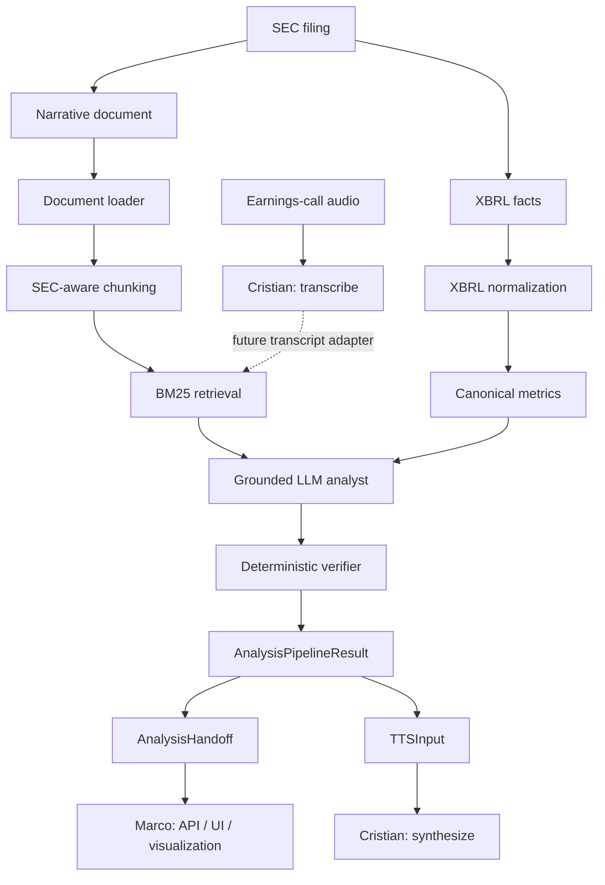

# FinTech Multimodal MVP

Prototipo académico de una startup FinTech basada en IA multimodal para
analizar filings SEC 10-K/10-Q y, progresivamente, earnings calls. Combina
texto narrativo, datos XBRL, análisis cualitativo grounded y métricas
deterministas para producir un resultado estructurado, verificable y apto para
visualización y síntesis de voz.

**Taller B5-T4 — octubre de 2026**

## Estado del proyecto

- Extracción y análisis SEC/XBRL: implementados y probados.
- Contrato de integración serializable para API/UI y TTS: implementado.
- Audio STT/TTS: integrado mediante Groq Whisper y Kokoro ONNX.
- FastAPI, Streamlit y visualización Plotly: integrados sobre el contrato
  `AnalysisHandoff`.

## Arquitectura



El flujo SEC/XBRL hasta `AnalysisHandoff`, la API, el dashboard y TTS están
integrados. La ingesta de transcripts como fuente `earnings_call` sigue siendo
una extensión futura.

## Responsabilidades

| Responsable | Ámbito |
|---|---|
| Dani | SEC ingestion, loader, chunking, BM25, normalización XBRL, métricas canónicas, LLM grounded, verifier y handoff de integración |
| Cristian | STT, TTS y contratos de audio |
| Marco | FastAPI, Streamlit/UI y visualización |

La UI presenta contratos ya calculados: no consulta XBRL, no ejecuta retrieval,
no recalcula métricas y no llama directamente a modelos.

## Métricas canónicas

El pipeline entrega inicialmente siete métricas:

| Métrica | Comparación preferida |
|---|---|
| Revenue | QoQ, duration quarter-only |
| Net Income | QoQ, duration quarter-only |
| Diluted EPS | QoQ, duration quarter-only; nunca se deriva por resta |
| Cash and Cash Equivalents | QoQ entre valores instant |
| Total Debt | QoQ entre valores instant consolidados |
| Operating Cash Flow | YoY YTD cuando es el contexto comparable seguro |
| Capital Expenditures | YoY YTD cuando es el contexto comparable seguro |

Estas cifras proceden exclusivamente de la capa determinista XBRL. El LLM no
las calcula, sustituye ni modifica.

## Grounding y verificación

- El backend construye un catálogo determinista de evidencias (`E01`, `E02`...):
  cada entrada es un extracto literal del chunk recuperado, con offsets
  trazables. El modelo solo devuelve `evidence_id`; `source_id`,
  `source_section` y el texto citado se reconstruyen en el backend.
- Un `evidence_id` inexistente bloquea el resultado.
- Si una generación falla grounding o verifier, se permite como máximo UNA
  regeneración con feedback estructurado y seguro. Nunca para errores de SEC,
  entrada, proveedor o retrieval vacío, y nunca se relaja ninguna regla.
- Findings, riesgos y outlook se redactan sin cifras libres: solo se admite una
  cifra idéntica a la del extracto seleccionado.
- El resumen ejecutivo solo puede mencionar cifras presentes en las métricas
  canónicas, con redondeo, dirección y tipo de comparación compatibles.
- El verifier comprueba métricas, números narrativos, citas, grounding,
  longitud del resumen y recomendaciones financieras explícitas.
- Los errores bloquean el resultado; los warnings se conservan como metadata.

## Modos real y demo

El handoff exige una etiqueta explícita:

- `analysis_mode="real"`: análisis producido mediante un proveedor real.
- `analysis_mode="demo"`: FakeLLM o fixture determinista previamente validada.

El modo demo no representa una inferencia remota. Existe para que una
presentación sea reproducible si un proveedor externo está lento o no
disponible; nunca se activa silenciosamente.

OpenRouter se validó correctamente con respuestas estructuradas reales. En una
ejecución posterior, el proveedor devolvió contenido vacío tras una generación
anómala y prolongada, mientras todas las etapas locales permanecieron verdes.
Este caveat externo motiva mantener un modo demo explícito.

## Requisitos e instalación

Entorno validado: Python 3.14.

```powershell
python -m venv .venv
.\.venv\Scripts\Activate.ps1
python -m pip install -r requirements.txt
python -m pytest -q
```

Los datos descargados, `.env`, audios, modelos y artefactos procesados no deben
versionarse.

### Arranque de API y dashboard

Con el entorno activado, usa dos terminales desde la raíz del repositorio:

```powershell
# Terminal 1 — FastAPI; OpenAPI en http://localhost:8000/docs
uvicorn src.api.main:app --reload --port 8000

# Terminal 2 — Streamlit en http://localhost:8501
streamlit run app/streamlit_app.py
```

La UI usa `http://localhost:8000` por defecto. Para otro backend, configura
`API_URL` antes de arrancar Streamlit.

La interfaz de producto usa inglés de forma consistente con las métricas
canónicas y el análisis generado. En modo real valida el ticker y consulta el
endpoint ligero de filings para ofrecer un selector por report date, filing
date y formulario; el usuario no necesita conocer la filing date exacta. Los
errores de SEC, proveedor, grounding y verificación se presentan sin detalles
sensibles ni fallback automático a demo.

- **Modo demo (por defecto):** la API carga el fixture sintético
  `src/api/demo_fixture.json`; no consulta SEC ni llama a un LLM.
- **Modo real:** requiere `EDGAR_IDENTITY`, `OPENROUTER_API_KEY` y
  `OPENROUTER_MODEL`. El request usa `filing_date`; `period` en la respuesta
  sigue siendo el periodo financiero reportado.
- **Audio:** la primera síntesis puede descargar el modelo Kokoro en
  `KOKORO_MODEL_DIR` y tardar más que las siguientes.

Los filings recientes pueden descubrirse sin ejecutar XBRL ni llamar al LLM:

```text
GET /api/v1/filings/{ticker}?filing_type=10-Q&limit=10
```

Cada entrada incluye `filing_date`, `report_date`, `form` y `accession`. El
análisis real usa un request inequívoco:

```json
{
  "ticker": "AAPL",
  "filing_type": "10-Q",
  "filing_date": "2026-07-31",
  "mode": "real"
}
```

## Configuración

Configura las variables en la terminal o en un `.env` local nunca versionado.

| Variable | Módulo | Requerida | Uso |
|---|---|---:|---|
| `EDGAR_IDENTITY` | SEC ingestion | Sí para SEC real | Identidad exigida por edgartools |
| `OPENROUTER_API_KEY` | OpenRouter | Sí en modo real | Autenticación del proveedor |
| `OPENROUTER_MODEL` | OpenRouter | Sí en modo real | Modelo elegido explícitamente |
| `OPENROUTER_BASE_URL` | OpenRouter | No | Base URL compatible; tiene default |
| `OPENROUTER_TIMEOUT_SECONDS` | OpenRouter | No | Timeout HTTP explícito |
| `OPENROUTER_TOTAL_DEADLINE_SECONDS` | OpenRouter | No | Límite total por generación; 90 s por defecto, incluidos reintentos |
| `OPENROUTER_MAX_RETRIES` | OpenRouter | No | Reintentos transitorios acotados |
| `GROQ_API_KEY` | Audio STT | Sí para STT real | Groq Whisper |
| `KOKORO_MODEL_DIR` | Audio TTS | No | Caché local de modelo y voces Kokoro |

Ejemplo sin secretos:

```powershell
$env:EDGAR_IDENTITY = "Nombre Apellido correo@dominio.example"
$env:OPENROUTER_API_KEY = "<configurar-localmente>"
$env:OPENROUTER_MODEL = "<modelo-compatible-con-json-schema>"
$env:GROQ_API_KEY = "<configurar-localmente>"
$env:KOKORO_MODEL_DIR = "C:\ruta\a\cache\kokoro"
```

## Ejecución del pipeline de análisis

Ejemplo mínimo real, sin claves hardcodeadas:

```python
from src.extraction import (
    OpenRouterLLMClient,
    prepare_sec_analysis_inputs,
    run_analysis_pipeline,
)
from src.integration import build_analysis_handoff

prepared = prepare_sec_analysis_inputs(
    ticker="AAPL",
    accession="0000320193-26-000020",
    form="10-Q",
)

with OpenRouterLLMClient.from_env() as client:
    result = run_analysis_pipeline(
        filing_path=prepared.filing_path,
        company=prepared.company,
        ticker=prepared.ticker,
        period=prepared.report_period,
        filing_type=prepared.filing_type,
        current_xbrl_filing=prepared.current_filing,
        previous_xbrl_filing=prepared.previous_filing,
        llm_client=client,
    )
    handoff = build_analysis_handoff(
        result,
        analysis_mode="real",
        provider="openrouter",
        model=client.model,
        filing_date=prepared.filing_date,
    )

payload = handoff.model_dump(mode="json")
```

El pipeline acepta cualquier implementación del protocolo `LLMClient`. Los
tests offline inyectan dobles deterministas; la aplicación integrada ofrece un
modo demo público basado en una fixture sintética y explícitamente etiquetada.

## Audio

El módulo `src.audio` expone:

```python
from src.audio import list_voices, synthesize, transcribe
from src.integration import build_tts_input

tts_input = build_tts_input(result, analysis_mode="real")
audio = synthesize(tts_input.text, language="en")

transcript = transcribe("earnings-call.mp3", language="en")
voices = list_voices("en")
```

- TTS consume directamente `executive_summary`.
- STT tiene un límite práctico de 25 MB por petición; calls largas requieren
  preprocesamiento antes de transcribir.
- La salida MP3 requiere `pydub` y FFmpeg; WAV es la salida nativa.
- Kokoro puede descargar y cargar aproximadamente 350 MB de modelo/voces en el
  primer uso, por lo que conviene hacer warm-up antes de una demo.

## Testing

```powershell
python -m pytest -q
python -m compileall src app
```

Estado integrado final (Dani + Cristian + Marco): `394 passed, 4 warnings`.
Los warnings conocidos son deprecaciones internas de edgartools 5.21.1 y de
`starlette.testclient` (uso de `httpx`), no fallos funcionales.

## Known limitations

- BM25 es retrieval léxico; todavía no existe retrieval semántico o híbrido.
- El catálogo productivo cubre siete métricas canónicas.
- La validación real profunda se ha realizado principalmente con AAPL.
- SEC/LLM/Groq son servicios externos y pueden sufrir latencia o indisponibilidad.
- El rendering SEC heredado puede contener el carácter de reemplazo U+FFFD.
- Earnings calls superiores a 25 MB necesitan preprocesamiento para STT.
- La propagación completa de `source_type="earnings_call"` hasta retrieval es
  una evolución futura.
- La ingesta de transcripts de earnings calls todavía no está conectada al
  pipeline de retrieval.

## Documentación de entrega

- [Contrato D8C](docs/integration/D8C_HANDOFF.md)
- [Checklist de demo](docs/demo/DEMO_CHECKLIST.md)
- [Checklist de integración final](docs/integration/FINAL_INTEGRATION_CHECKLIST.md)

## Licencia

Proyecto académico — Taller B5-T4.
