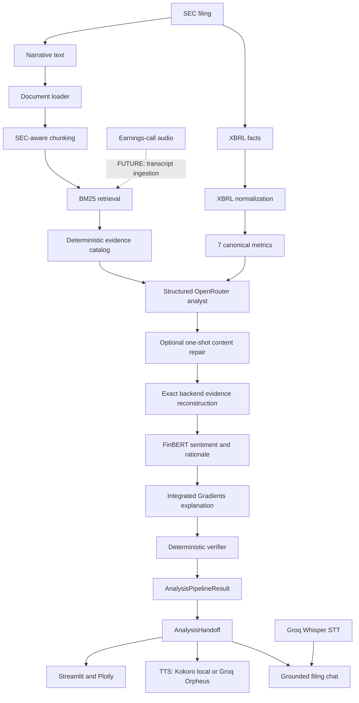

# FinTech Multimodal MVP

Copiloto B2B de análisis financiero que convierte filings SEC 10-K/10-Q y
datos XBRL en métricas canónicas, hallazgos con evidencia literal, análisis
verificado, visualizaciones, conversación contextual y audio.

Está dirigido principalmente a analistas buy-side, gestores de activos,
equipos de equity research, due diligence y auditoría. Es una herramienta de
apoyo a la investigación: no ofrece asesoramiento de inversión ni ejecuta
operaciones.

**Taller B5-T4 — octubre de 2026**

## Propuesta de valor

- combina narrativa SEC y fundamentales XBRL en un único flujo;
- calcula siete métricas financieras sin delegar su cálculo al LLM;
- restringe el análisis cualitativo a un catálogo determinista de evidencia;
- reconstruye evidencia, sección y source ID en el backend;
- bloquea análisis que no superen grounding y verificación determinista;
- añade sentimiento financiero explicable con FinBERT e Integrated Gradients;
- entrega dashboard, chat contextual, entrada de voz y salida TTS; y
- diferencia siempre datos reales de la fixture sintética de demostración.

El [business case](docs/BUSINESS_CASE.md) detalla cliente, viabilidad,
monetización, compliance, privacidad y riesgos. La evidencia disponible sobre
costes y tiempos está en [cost and latency](docs/COST_LATENCY.md).

## Estado actual

- SEC discovery, narrativa, XBRL, chunking, BM25 y métricas: integrados.
- OpenRouter structured analysis, evidence catalog, bounded repair, grounding
  y verifier: integrados.
- FinBERT e Integrated Gradients: integrados con degradación segura si el
  modelo local no está disponible.
- FastAPI, Streamlit, Plotly y filing chat: integrados.
- Groq Whisper STT, Kokoro TTS local y Groq Orpheus TTS opcional: integrados.
- Docker multi-stage y despliegue Cloud Run: validados.
- Earnings-call audio como fuente del pipeline de análisis: **no implementado**.

## Arquitectura multimodal



La UI consume FastAPI mediante HTTP. No consulta SEC/XBRL, no ejecuta BM25,
no recalcula métricas y no llama directamente a modelos.

### Responsabilidades

| Responsable | Ámbito |
|---|---|
| Dani | SEC ingestion, loader, chunking, BM25, XBRL, métricas, LLM grounded, verifier e integration handoff |
| Cristian | STT, TTS y contratos de audio |
| Marco | FastAPI, Streamlit y visualización |

## Interfaz de producto

El resultado se distribuye en cuatro tabs:

1. **Overview** — snapshot ejecutivo, KPIs y estado de verificación.
2. **Financials** — siete métricas, comparativas, gráficos y tabla detallada.
3. **Narrative** — positives, risks, outlook, resumen y TTS.
4. **Sources** — evidencia, provenance, verification y detalles técnicos.

El filing chat aparece como un panel flotante **Ask about this filing**, no como
un quinto tab. En modo real, el selector consulta filings disponibles y separa
claramente filing date de report period.

## Modelos y componentes

| Componente | Implementación | Función |
|---|---|---|
| SEC | edgartools 5.21.1 | Discovery, narrativa y XBRL |
| Retrieval | rank-bm25 | Recuperación léxica sobre chunks SEC-aware |
| Financial analyst | OpenRouter, modelo configurable | JSON estructurado cualitativo |
| Metrics/verifier | Reglas deterministas | Métricas, grounding y validación |
| Sentiment | `ProsusAI/finbert` | Sentimiento financiero del outlook |
| XAI | Integrated Gradients | Explicación local de la rationale sentence |
| Chat | OpenRouter streaming | Preguntas sobre `AnalysisHandoff` |
| STT | Groq `whisper-large-v3-turbo` | Voz a pregunta de chat |
| TTS local | Kokoro v1.0 ONNX, 82M | Audio local de summary/respuesta |
| TTS remoto opcional | Groq `canopylabs/orpheus-v1-english` | Audio en inglés seleccionado explícitamente |
| API/UI | FastAPI, Streamlit, Plotly | Orquestación y presentación |

## Métricas canónicas

| Métrica | Comparación preferida |
|---|---|
| Revenue | YoY, mismo trimestre del año anterior |
| Net Income | YoY, mismo trimestre del año anterior |
| Diluted EPS | YoY quarter-only; nunca derivada por resta |
| Cash and Cash Equivalents | YoY entre valores instant |
| Total Debt | YoY entre valores instant consolidados |
| Operating Cash Flow | YoY YTD cuando es comparable |
| Capital Expenditures | YoY YTD cuando es comparable |

Las métricas proceden de XBRL y el LLM no las recalcula ni modifica. Cuando no
existe una comparación segura, el resultado usa `None`/`N/A`, nunca cero.

## Grounding y verificación

- El backend genera un catálogo determinista (`E01`, `E02`, ...) a partir de
  extractos literales y trazables de los chunks recuperados.
- El LLM selecciona `evidence_id`; no proporciona la evidence final ni sus
  campos técnicos.
- El backend reconstruye literalmente evidence, source ID y source section
  desde el catálogo.
- Un ID inexistente bloquea la generación.
- Grounding o verifier pueden activar como máximo una regeneración con feedback
  seguro; los errores de provider, SEC o input no activan content repair.
- El verifier valida métricas, números narrativos, evidencia, metadata,
  longitud del summary y recomendaciones financieras explícitas.
- Los errores bloquean el resultado; los warnings permanecen como metadata.

Estas restricciones reducen el riesgo de alucinación, pero no convierten al
LLM en una garantía autónoma de factualidad ni sustituyen la revisión del
filing original.

## FinBERT e Integrated Gradients

`ProsusAI/finbert` clasifica el sentimiento financiero del management outlook.
Una rationale sentence literal del filing citado se utiliza para la explicación
local.

La atribución Integrated Gradients se calcula:

- en el espacio de embeddings;
- con baseline de embedding cero;
- con 32 pasos de interpolación;
- sobre el logit de la clase de sentimiento seleccionada; y
- agregando WordPieces en palabras.

Para visualización se eliminan tokens especiales, puntuación, stopwords y
atribuciones no positivas. Los scores restantes se normalizan respecto a la
mayor atribución positiva. Son **intensidades relativas de atribución** y no
suman 100%; no representan “porcentaje de responsabilidad”.

Si FinBERT o sus dependencias no están disponibles, el pipeline conserva el
sentimiento grounded existente y deja confidence/model/XAI sin completar.

## Filing chat y voz

El chat recibe únicamente el `AnalysisHandoff` ya verificado. El prompt exige
citas `[M1]`, `[P1]`, `[R1]`, `[O1]`, `[S1]`, abstención cuando el contexto no
cubre la pregunta y bloqueo de recomendaciones buy/sell/hold.

Estas reglas son **prompt-enforced**: todavía no existe un verificador
determinista post-generación que valide todas las citas de chat. Por tanto, el
chat no comparte la misma garantía determinista que el core analysis.

- STT usa Groq `whisper-large-v3-turbo`, requiere `GROQ_API_KEY` y transforma
  voz en una pregunta de chat.
- STT no incorpora earnings calls al pipeline SEC/BM25.
- TTS usa por defecto Kokoro v1.0 ONNX 82M. El chat permite seleccionar Groq
  `canopylabs/orpheus-v1-english` para respuestas en inglés.
- El API normaliza texto hablable para ambos motores. Si se solicita Groq para
  texto español, el routing explícito usa una voz española Kokoro; un fallo de
  Groq no activa fallback silencioso y se devuelve como error.
- El executive summary y las respuestas de chat continúan usando
  `/api/v1/audio/summary`; la UI de summary mantiene el proveedor local por
  defecto.
- En Docker, FinBERT y Kokoro quedan baked para ejecución local/offline de esos
  modelos tras construir la imagen.

## Modos demo y real

- **Demo:** fixture sintética determinista; no consulta SEC ni llama al LLM de
  análisis. Siempre aparece etiquetada como `DEMO | SYNTHETIC`.
- **Real:** SEC live más el modelo OpenRouter configurado. Nunca cae a demo de
  forma silenciosa.

El dashboard demo funciona sin credenciales de análisis. Chat requiere
OpenRouter y STT requiere Groq incluso cuando se parte de un handoff demo. El
TTS local no requiere proveedor remoto, pero necesita los assets Kokoro; Groq
TTS requiere `GROQ_API_KEY` y envía el texto normalizado al proveedor.

## Instalación local

El entorno local auditado usa **Python 3.14.3**. La imagen Docker utiliza
**Python 3.12-slim**; son runtimes distintos y ambos se documentan
explícitamente.

```powershell
python -m venv .venv
.\.venv\Scripts\Activate.ps1
python -m pip install -r requirements.txt
python -m pytest -q
```

### Configuración

| Variable | Requerida | Uso |
|---|---:|---|
| `EDGAR_IDENTITY` | SEC real | Identidad exigida por SEC/edgartools |
| `OPENROUTER_API_KEY` | análisis/chat real | Autenticación OpenRouter |
| `OPENROUTER_MODEL` | análisis/chat real | Modelo configurable |
| `OPENROUTER_BASE_URL` | No | Endpoint compatible |
| `OPENROUTER_TIMEOUT_SECONDS` | No | Timeout de transporte |
| `OPENROUTER_TOTAL_DEADLINE_SECONDS` | No | Deadline por generación; default 90 s |
| `OPENROUTER_MAX_RETRIES` | No | Reintentos transitorios acotados |
| `GROQ_API_KEY` | STT y Groq TTS opcional | Groq Whisper y Orpheus |
| `KOKORO_MODEL_DIR` | No | Directorio local Kokoro |
| `KOKORO_THREADS` | No | Override de hilos ONNX; por defecto usa la cuota disponible |
| `API_URL` | No | Backend consumido por Streamlit |

Usa variables de entorno o un `.env` local no versionado. Nunca hardcodees
claves en código, documentación o imágenes.

### Arranque local

Desde la raíz, en dos terminales con el entorno activo:

```powershell
# Terminal 1 — API; OpenAPI en http://localhost:8000/docs
uvicorn src.api.main:app --reload --port 8000

# Terminal 2 — UI en http://localhost:8501
streamlit run app/streamlit_app.py
```

La UI usa `http://localhost:8000` por defecto. Configura `API_URL` si el
backend está en otra dirección.

## Docker

La imagen multi-stage usa Python 3.12-slim, PyTorch CPU, usuario non-root y
assets FinBERT/Kokoro baked. Arranca FastAPI internamente en 8000 y Streamlit
en `$PORT` —8080 por defecto— y expone un healthcheck.

```powershell
docker build -t fintech-multimodal-mvp .

# Demo base, sin credenciales externas
docker run --rm -p 8080:8080 fintech-multimodal-mvp

# Funciones reales, con un archivo local nunca versionado
docker run --rm -p 8080:8080 --env-file .env fintech-multimodal-mvp
```

Aplicación: `http://localhost:8080`.

## Cloud Run

El workflow de GitHub Actions construye y publica la imagen en Artifact
Registry y despliega el servicio `fintech-mvp` en `europe-southwest1`. El
despliegue del HEAD actual y su health smoke están validados.

URL pública verificada:

<https://fintech-mvp-4dosd3lf3a-no.a.run.app>

El acceso a real analysis, filing chat y STT depende de que Cloud Run tenga
configuradas las credenciales externas correspondientes.

## API principal

```text
GET  /health
GET  /api/v1/filings/{ticker}?filing_type=10-Q&limit=10
POST /api/v1/analysis
POST /api/v1/chat
GET  /api/v1/audio/voices
POST /api/v1/audio/summary
POST /api/v1/audio/transcribe
```

El request real de análisis usa `filing_date`; el `period` de la respuesta es
el periodo financiero reportado.

## Testing

```powershell
python -m pytest -q
python -m compileall src app
python -m pip check
git diff --check
```

Estado certificado del HEAD actual después de integrar Groq TTS:

```text
613 passed, 4 skipped, 0 failed, 4 warnings
```

Los cuatro skips son tests con un tiny BERT y gradientes reales que requieren
`torch`, ausente en el `.venv` auditado. `requirements.txt` y Docker sí incluyen
PyTorch; no se afirma `589/589` hasta ejecutar esos casos sin skips.

Los warnings son deprecaciones conocidas de edgartools y
`starlette.testclient`/`httpx`.

## Known limitations

- BM25 es retrieval léxico; no hay retrieval semántico/híbrido.
- El catálogo productivo cubre siete métricas canónicas.
- La validación real profunda se ha concentrado principalmente en AAPL.
- SEC, OpenRouter y Groq pueden sufrir latencia o indisponibilidad.
- Groq TTS solo admite inglés en la integración actual, requiere credencial y
  no tiene coste/latencia productivos medidos. El routing de español usa
  Kokoro local.
- El rendering SEC heredado puede contener U+FFFD.
- Chat usa citas/abstention por prompt, sin verifier determinista de citas.
- Los cuatro tests IG reales permanecen omitidos en el entorno local auditado.
- Costes y latencias de producto aún no forman un dataset completo y
  versionado.
- Audio STT de más de 25 MB requiere preprocesamiento.
- Earnings-call transcripts no están conectados a retrieval/análisis.
- No existe todavía una política formal de retención de audio/chat/logs ni se
  reclama certificación GDPR, SOC 2 o equivalente.

## Documentación

- [Business case](docs/BUSINESS_CASE.md)
- [Cost and latency evidence](docs/COST_LATENCY.md)
- [Contrato D8C](docs/integration/D8C_HANDOFF.md)
- [Checklist de demo](docs/demo/DEMO_CHECKLIST.md)
- [Checklist de integración](docs/integration/FINAL_INTEGRATION_CHECKLIST.md)
- [Current integrated state](docs/HANDOFF_CURRENT_STATE.md)
- [Design system](DESIGN.md)

## Licencia

Proyecto académico — Taller B5-T4.
