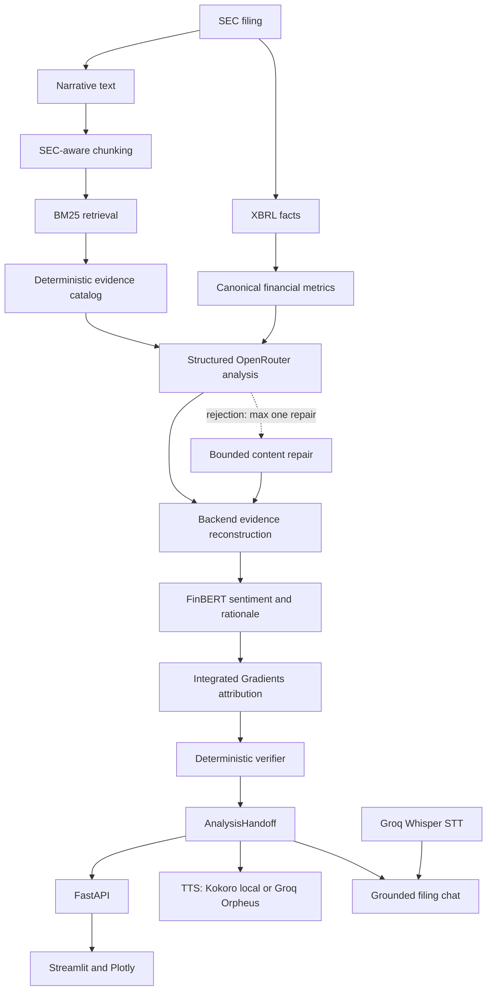

# Business case

## 1. Problem

Institutional financial analysis still requires professionals to reconcile
several sources and formats manually: long SEC filings, narrative sections,
XBRL fundamentals, risk disclosures, management outlook, and supporting
evidence. When voice interaction and explainability are added, the workflow
becomes even more fragmented.

The primary operational pain points are:

- 10-K and 10-Q filings are long and costly to inspect repeatedly;
- narrative claims and structured fundamentals are usually reviewed in
  separate tools;
- comparisons and evidence trails require manual reconciliation;
- generic LLM summaries often have weak provenance and can introduce
  unsupported statements or numbers;
- provider latency and manual review consume analyst time;
- black-box classifications are difficult to challenge or explain; and
- audio interaction is usually disconnected from the verified analysis.

The product addresses this workflow as a research-support system. It does not
replace professional judgement, audit procedures, or regulated investment
advice.

## 2. Target customer

The product is **B2B**.

Primary users:

- buy-side analysts;
- asset managers;
- equity-research teams;
- financial due-diligence teams; and
- auditors and assurance teams.

Secondary users include corporate-finance and investor-relations teams that
need a traceable view of public filings and reported fundamentals.

B2B is a better fit than B2C because the value comes from reducing repeated
professional research work, preserving provenance, supporting governance, and
integrating with team workflows. Institutional customers also have clearer
requirements for access control, auditability, provider configuration, and
API integration than a general retail-investor product. The current MVP does
not provide personal portfolio advice or consumer trade recommendations.

## 3. Value proposition

The product is a verified financial-analysis copilot that turns SEC filings
and structured fundamentals into:

- seven canonical financial metrics calculated deterministically from XBRL;
- grounded qualitative findings and risks;
- literal supporting evidence with source provenance;
- visual dashboards and comparable-period views;
- explainable financial sentiment;
- audio executive summaries;
- conversational interaction grounded to the verified analysis handoff; and
- optional voice input for chat.

The main differentiators are:

1. **Evidence-grounded output.** The LLM selects a closed-vocabulary
   `evidence_id`; it does not author the quoted evidence or its source fields.
2. **Backend reconstruction.** The application reconstructs the exact evidence,
   source ID, and section from the deterministic catalog.
3. **Deterministic verification.** The final core analysis is checked against
   canonical metrics, evidence, metadata, numeric policy, and recommendation
   rules before it is accepted.
4. **Bounded recovery.** A rejected generation can trigger at most one content
   repair. Provider failures do not create an unrestricted retry loop.
5. **Multimodal orchestration.** SEC text, XBRL data, an LLM, FinBERT,
   Integrated Gradients, visual output, STT, and TTS are connected through
   explicit contracts.
6. **Explainable sentiment.** FinBERT classifies the grounded management
   outlook and a local Integrated Gradients explanation highlights supporting
   terms in a cited rationale sentence.
7. **Honest operating modes.** Real mode never silently falls back to the
   deterministic synthetic demo.

Chat is grounded to the already verified `AnalysisHandoff` and uses
prompt-enforced citations and abstention. It does **not** yet have a
deterministic post-generation citation verifier, so it must not be described
as having the same verification guarantee as the core filing analysis.

## 4. Technical viability

### Implemented flow



The architecture separates business/model logic, integration contracts,
FastAPI orchestration, and Streamlit presentation. The UI consumes the API and
does not call SEC, XBRL, retrieval, or model modules directly.

### Validation evidence

- The earlier audit at commit `afead47` recorded 583 passed, 4 skipped, and
  0 failed tests.
- Revalidation after integrating Groq TTS at `6f336be` records **613 passed,
  4 skipped, and 0 failed** tests. The documentation closure does not change
  product code.
- `compileall`, `pip check`, and `git diff --check` were clean in the final
  forensic audit.
- The multi-stage Docker image installs CPU-only PyTorch and bakes Kokoro and
  FinBERT weights for offline runtime use.
- The Docker build, Cloud Run deployment, and health smoke completed
  successfully for the current `main` workflow.
- Real SEC filing discovery and the distinction between filing date and report
  period are implemented.
- Real analysis uses structured OpenRouter output, deterministic evidence IDs,
  strict grounding, deterministic verification, and a total generation
  deadline.
- Groq Whisper STT feeds filing chat. Kokoro remains the default local TTS for
  summary and chat audio; users can select Groq Orpheus for English chat
  responses. Spanish text is routed explicitly to Kokoro.

### Caveats

- Four Integrated Gradients tests were skipped in the audited local
  environment because `torch` was not installed there. The tests exist and
  Docker installs CPU-only PyTorch, but a final environment should run them
  without skips.
- FinBERT degrades safely to the existing outlook label when its local model or
  dependencies are unavailable.
- Chat citations and recommendation abstention are prompt-enforced, not
  deterministically post-verified.
- STT currently provides voice questions to chat. Earnings-call transcripts
  are not yet ingested into the filing retrieval/analysis pipeline.

### Precise interpretation of FinBERT and XAI

The sentiment model is `ProsusAI/finbert`, a financial-domain sentiment
classifier. It scores the grounded management-outlook summary and selects a
literal cited rationale sentence for local explanation.

The token explanation is an Integrated Gradients approximation computed in
embedding space with a zero-embedding baseline and 32 interpolation steps. The
target is the selected sentiment-class logit, not a hardcoded positive class.
WordPiece subwords are aggregated into words. For display, special tokens,
punctuation, stopwords, and non-positive attributions are removed; the
remaining values are normalized relative to the largest positive attribution.
They are therefore **relative attribution intensities** and do not sum to
100%. They must not be presented as a token's "percentage responsibility" for
the model decision.

## 5. Economic viability

The MVP demonstrates technical viability, but it does not yet contain enough
production usage data to claim a validated unit-economic model. Costs must be
tracked by category and measured under a representative workload.

### A. Variable costs

- **LLM analysis per filing:** OpenRouter prompt/completion tokens, including a
  possible second bounded generation.
- **Chat:** streamed LLM tokens per question and answer.
- **STT:** provider charge based on audio duration or provider billing unit.
- **Optional Groq TTS:** external synthesis requests for selected English
  speech. Its price and latency have not been measured in this project.

### B. Mostly local or compute costs

- **FinBERT:** local CPU inference; no per-call model API fee, but it consumes
  container CPU and memory.
- **Integrated Gradients:** 32 interpolation steps executed locally; primarily
  CPU/memory cost.
- **Kokoro TTS:** local inference; no per-call provider fee, but it consumes
  compute and increases image/model-storage requirements.

### C. Infrastructure costs

- Cloud Run request, vCPU-time, and memory-time charges;
- Artifact Registry image storage;
- network egress where applicable;
- Secret Manager and logging usage; and
- build minutes/cache storage where applicable.

Exact rates depend on region, provider contracts, free tiers, and traffic. They
are therefore marked **TO BE MEASURED**, not inferred from list prices in this
document. The measurement plan is defined in `docs/COST_LATENCY.md`.

The working cost formulas are:

```text
Cost_per_filing =
    LLM_analysis_cost
  + optional_chat_cost
  + optional_STT_cost
  + optional_Groq_TTS_cost
  + allocated_cloud_compute

Monthly_cost =
    N_filings * variable_cost_per_filing
  + cloud_fixed_or_minimum
  + optional_voice_usage
  + storage_and_network
```

Economic viability should be assessed by comparing these costs with analyst
time saved, the number of filings reviewed, review quality, and the governance
value of reproducible evidence.

## 6. Monetization

A plausible commercial model is B2B SaaS with optional API usage:

- **Basic:** filing discovery, canonical metrics, dashboard, and verified core
  analysis.
- **Professional:** filing chat, XAI views, voice input, and audio summaries.
- **Enterprise:** SSO, governance controls, audit logs, configurable providers,
  API access, usage reporting, support, and optional private deployment.

Charging units could combine analyst seats, team workspaces, included filing
analyses, and metered API usage. Any prices shown in a future pitch should be
labelled illustrative until customer discovery and measured cost data support
them.

## 7. Compliance and financial-risk controls

The product is a research-support tool, not an investment adviser or trading
system:

- it does not execute trades;
- the core verifier blocks explicit buy/sell/hold recommendations;
- financial metrics are computed deterministically from selected XBRL facts;
- qualitative findings require catalogued filing evidence;
- evidence text and source metadata are reconstructed by the backend;
- invalid grounding or verification blocks the core analysis result; and
- provider failure does not silently replace real analysis with demo data.

Residual risks remain:

- qualitative LLM interpretation can still be incomplete or wrong;
- filing chat lacks deterministic post-generation citation verification;
- providers can be slow, unavailable, or change behavior;
- SEC filings and XBRL facts can contain source-data or rendering issues;
- FinBERT attribution is a local model explanation, not proof of causality; and
- professional users remain responsible for reviewing primary documents and
  applying their own regulated procedures.

Production deployment would require legal review, appropriate disclaimers,
role-based access, audit logging, model/provider governance, and a documented
incident process.

## 8. Privacy and data handling

- SEC filing data used by the core pipeline is public.
- API credentials are supplied through environment variables or secret
  management and are not returned to the client.
- Public errors are sanitized and exclude prompts, provider bodies, stack
  traces, and authorization headers.
- Voice audio is sent to Groq when STT is used.
- Text selected for Groq TTS is sent to Groq for speech synthesis. Kokoro TTS
  remains local and does not send synthesis text to an external TTS provider.
- Analysis and chat content is sent to the configured OpenRouter provider when
  real LLM functionality is used.
- Chat history is held in the current Streamlit session and resent with the
  handoff on each stateless chat request.
- A formal retention/deletion policy for audio, chat history, provider logs,
  and application logs has not yet been implemented.

The project does not claim GDPR, SOC 2, ISO 27001, or equivalent compliance.
Data-processing agreements, retention controls, regional processing,
encryption policy, user access management, and deletion/audit procedures are
future enterprise requirements.

## 9. Current business-case conclusion

The repository supports a credible technical MVP for a B2B financial research
copilot. Its strongest defensible value is the combination of deterministic
financial metrics, constrained evidence selection, backend reconstruction, and
verification. Commercial viability remains a hypothesis until the team adds
measured unit costs, customer validation, operational SLAs, and enterprise
governance requirements.
