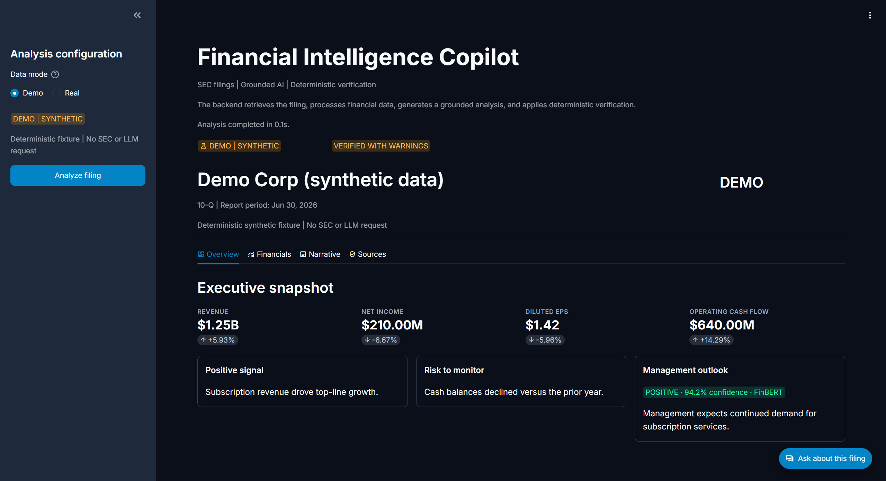
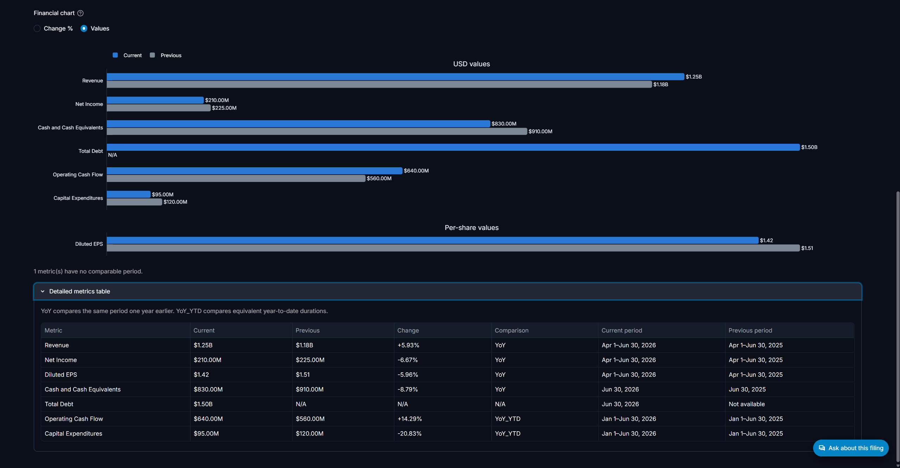
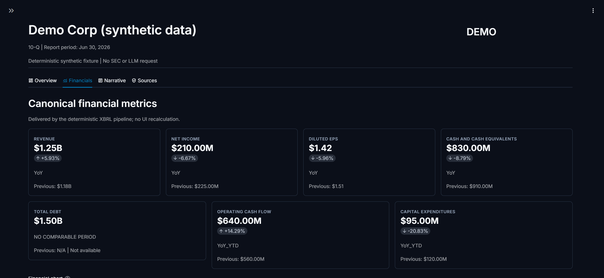
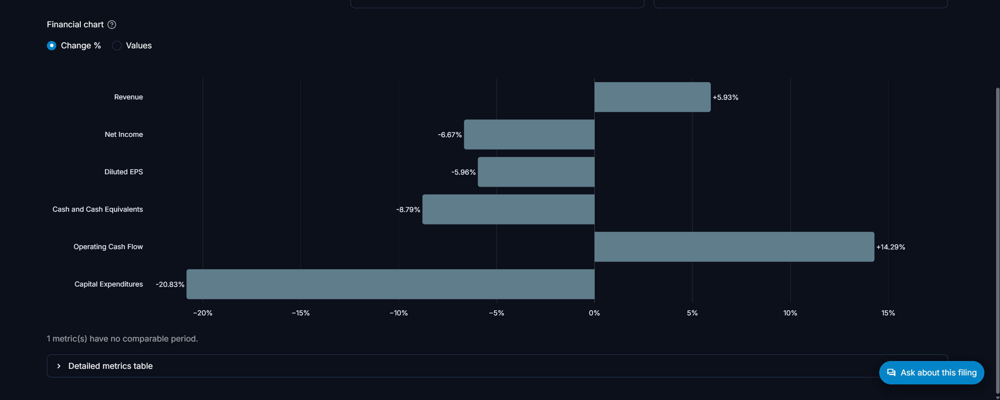
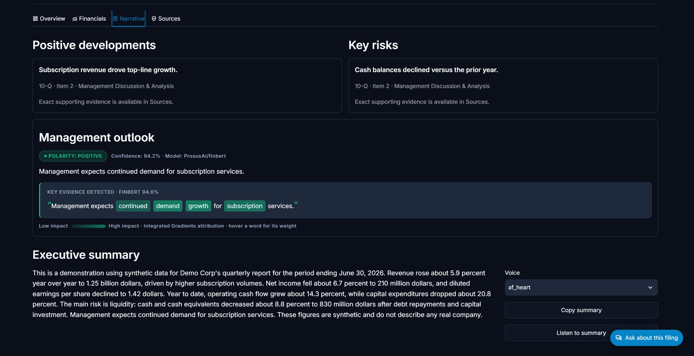
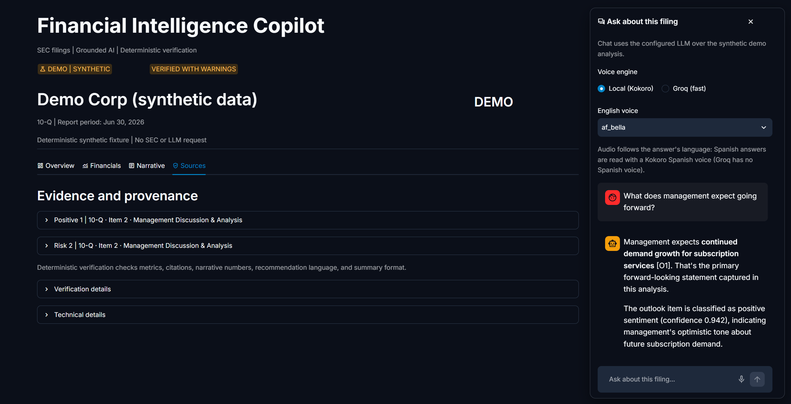

# Pitch visual — guía de pantallas

Guía de la interfaz para analistas y bloques listos para enlazar las capturas desde `README.md` y `BUSINESS_CASE.md`. El sistema de diseño completo está en [`DESIGN.md`](../DESIGN.md).

Todas las capturas usan el modo DEMO (Demo Corp, datos sintéticos, 10-Q a 30 jun 2026): no contienen datos SEC reales.

## Inventario de capturas (`docs/assets/`)

| Archivo | Pestaña UI | Qué muestra |
|---|---|---|
| `tab1_overview_snapshot.png` | Overview | Cabecera, badges DEMO / verificación, snapshot ejecutivo con 4 KPIs, señal positiva, riesgo y outlook FinBERT |
| `tab2_financial_metrics_yoy.png` | Financials | Gráfico de valores absolutos (USD y per-share, Actual vs Anterior) y tabla canónica detallada |
| `tab2_kpis_yoy.png` | Financials | Rejilla de las 7 KPI cards con variación YoY / YoY_YTD y valor anterior |
| `tab2_chart_change_pct.png` | Financials | Gráfico de variación porcentual por métrica |
| `tab3_drivers_xai_outlook.png` | Narrative | Positivos y riesgos con sección SEC, outlook con heatmap XAI de FinBERT, resumen ejecutivo y controles de audio |
| `tab4_compliance_verification.png` | Sources | Evidencia y procedencia, verificación determinista y Copilot conversacional abierto |

## Pantallas

### Tab 1 — Overview



Snapshot del filing en una sola vista: KPIs ejecutivos (revenue, net income, EPS diluido, operating cash flow) con su variación, la señal positiva y el riesgo principal, y el outlook de gestión con polaridad y confianza FinBERT.
**Propuesta de valor:** menos fricción cognitiva. El analista sabe en segundos si el filing merece lectura profunda, sin abrir 100+ páginas.

### Tab 2 — Financials



Valores absolutos en USD y por acción en barras duales (Actual vs Anterior), con la tabla canónica que indica el tipo de comparación (YoY, YoY_YTD) y los periodos exactos.

- Vista complementaria — KPI Cards YoY:

  

- Vista complementaria — Gráfico de variación porcentual:

  

**Propuesta de valor:** trazabilidad contable. Las siete métricas vienen del XBRL oficial por un pipeline determinista y la UI no recalcula nada; si no hay periodo comparable, se dice ("NO COMPARABLE PERIOD") en lugar de inventarlo.

### Tab 3 — Narrative



Positivos y riesgos con la sección SEC de origen; outlook de gestión clasificado por FinBERT con la frase de evidencia resaltada mediante Integrated Gradients (cuanto más intensa la pill, más pesa la palabra; al pasar el cursor o enfocar con teclado aparece su impacto). Debajo, el resumen ejecutivo con selector de voz, copia y lectura en audio (Kokoro local o Groq).
**Propuesta de valor:** explicabilidad algorítmica. El modelo no da un veredicto opaco; enseña qué palabras del filing lo han llevado a esa polaridad.

### Tab 4 — Sources & Compliance



Evidencia y procedencia de cada hallazgo, detalle de la verificación determinista (métricas, citas, números narrativos, lenguaje de recomendación y formato del resumen) y el Copilot conversacional, que responde citando la evidencia (`[O1]`) y puede leer la respuesta en voz alta.
**Propuesta de valor:** confianza auditable. Cualquier conclusión se puede rastrear hasta el fragmento exacto del filing.

## Bloques para copiar

Desde un archivo en la raíz del repo (`README.md`, `BUSINESS_CASE.md`):

```markdown


```

Desde un archivo dentro de `docs/` las rutas pierden el prefijo `docs/`:

```markdown


```
